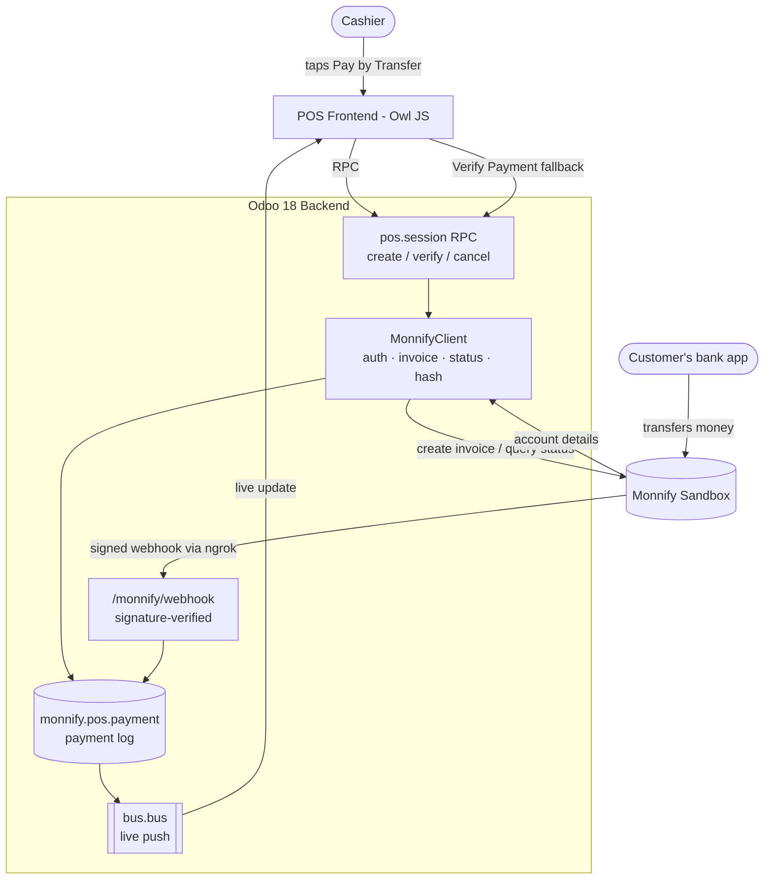

# Pay by Transfer (Monnify) for Odoo POS

> A "Pay by Transfer" payment method for Odoo Point of Sale, powered by Monnify dynamic virtual accounts. The cashier taps one button, a one-time account appears on screen, the customer transfers from any banking app, and the sale confirms itself the moment the money lands — verified server-to-server, never on a cashier's word.

**API Conference Lagos 2026 — Monnify Developer Challenge**
Sandbox only. Built on Odoo 18 Community.

📹 **Demo video:** _()_

---

## Table of contents
- [The problem](#the-problem)
- [The solution](#the-solution)
- [How it works](#how-it-works)
- [Architecture](#architecture)
- [Monnify APIs used](#monnify-apis-used)
- [Repository layout](#repository-layout)
- [Local setup (step by step)](#local-setup-step-by-step)
- [Testing](#testing)
- [Security](#security)
- [Known limitations](#known-limitations)
- [Team & license](#team--license)

---

## The problem

Across Nigerian retail, a huge share of in-person payments are **bank transfers**. But at the point of sale this creates a quiet, daily problem: **the cashier has no reliable way to know, in real time, that the exact payment for _this_ order actually arrived.**

So they improvise — squint at a customer's "successful transfer" screenshot (which can be faked or be for a different amount), or hold up the queue calling a colleague to check the bank app. It's slow, it's error-prone, and it's a genuine fraud vector.

**This project closes that trust gap in seconds.**

## The solution

When the cashier selects **Pay by Transfer (Monnify)** on an order, Odoo asks Monnify for a **one-time dynamic virtual account** scoped to that exact amount. The account number shows on the POS screen. The customer transfers from their own banking app. Odoo then confirms the payment **two independent ways**:

1. **Automatically** — Monnify sends a signed webhook the instant the money lands, and the POS screen flips to _"Payment received"_ on its own.
2. **On demand** — a **Verify Payment** button polls Monnify server-to-server, so the flow still works even if the webhook or tunnel is delayed. _Resilient by design._

Both paths run the **same** verification logic, which checks the **paid amount against the order total** — a payment is never marked complete on status alone.

### Key features
- One-tap dynamic virtual account per order (no customer BVN/NIN, no KYC).
- Real-time auto-confirmation over the Odoo bus.
- Manual **Verify Payment** fallback — the demo works even if the network hiccups.
- Exact-amount enforcement — under/over-payments are flagged, never silently accepted.
- **Payer confirmed by name** — the paid screen shows the account the money actually came from (e.g. "from ADEBAYO JOHN").
- Webhook signature verification (HMAC-SHA512 over the raw body).
- Standard Odoo accounting — payments reconcile through Odoo's normal session-close flow, no custom accounting code.
- **Payments dashboard** — every transfer logged (expected vs received, status, items ordered), in-Odoo and as a standalone view.
- **AI daily briefing** — Claude turns the day's collections into a plain-English summary for the shop owner; grounded in real data, and kept entirely out of the payment-decision path.

## How it works

```
Cashier taps "Pay by Transfer (Monnify)"
  → POS frontend calls the Odoo backend (RPC)
    → Odoo asks Monnify to create a dynamic virtual account for the order total
    → account number + bank shown on the POS screen; a countdown starts
Customer transfers the exact amount from their banking app
  → AUTO:   Monnify → signed webhook → Odoo verifies signature + amount → screen flips to paid
  → MANUAL: cashier taps "Verify Payment" → Odoo polls Monnify → confirms + completes
Order completes → receipt prints
At session close → Odoo aggregates the payment into its normal accounting entries
```

## Architecture

Three layers, cleanly separated. The POS frontend **never** talks to Monnify or holds any API key — it only speaks to the Odoo backend.



Two Odoo modules:

| Module | Responsibility |
|---|---|
| **`monnify_base`** | Everything that talks _to Monnify_: the API client, credential config, the payment log model, and the webhook receiver. Knows nothing about the POS UI. |
| **`monnify_pos`** | Everything that wires Monnify _into the POS_: the payment method, the backend RPC the till calls, and the cashier-facing popup + live updates. Depends on `monnify_base`. |

See [`docs/architecture.md`](docs/architecture.md) for the full design and [`docs/monnify-api-reference.md`](docs/monnify-api-reference.md) for verified request/response shapes.

## Monnify APIs used

All against the **sandbox** (`https://sandbox.monnify.com`):

| Purpose | Endpoint |
|---|---|
| Authenticate (Bearer token, cached) | `POST /api/v1/auth/login` |
| Create a one-time dynamic virtual account | `POST /api/v1/invoice/create` |
| Query transaction status (Verify button) | `GET /api/v2/merchant/transactions/query` |
| Receive payment notifications | Webhook → your `/monnify/webhook` route |

The webhook is authenticated with Monnify's **HMAC-SHA512** transaction hash (`monnify-signature` header), computed over the raw request body with your secret key and compared in constant time.

## Repository layout

```
Odoo-Monnify-pos/
├── addons/
│   ├── monnify_base/                      # Monnify protocol layer
│   │   ├── services/monnify_client.py     # pure-Python API client (no Odoo imports)
│   │   ├── models/
│   │   │   ├── res_config_settings.py     # credentials → configured client
│   │   │   └── monnify_pos_payment.py     # payment log + the ONE completion function
│   │   ├── controllers/webhook.py         # /monnify/webhook (signature-verified)
│   │   ├── security/ir.model.access.csv
│   │   └── tests/test_client.py           # known-answer webhook-hash tests
│   └── monnify_pos/                        # POS integration layer
│       ├── models/
│       │   ├── pos_payment_method.py      # registers the "Monnify" payment terminal
│       │   └── pos_session.py             # create / verify / cancel RPC endpoints
│       └── static/src/app/
│           ├── payment_monnify.js         # PaymentInterface subclass (owns the flow)
│           ├── monnify_popup.js           # account-details popup (Owl Dialog)
│           └── monnify_popup.xml
├── docs/                                   # architecture + verified API reference
├── scripts/smoke_test.py                   # exercise the client against live sandbox
├── auth.py                                 # day-1 standalone API verification
├── .env.example
└── requirements.txt
```

## Local setup (step by step)

### Prerequisites
- **Python 3.12**, **PostgreSQL**, and an **Odoo 18 Community** source checkout.
- A [Monnify sandbox account](https://app.monnify.com) for API keys (API key, secret key, contract code).
- [ngrok](https://ngrok.com) (only needed for the automatic webhook; the Verify button works without it).

### 1. Clone and configure credentials
```bash
git clone <your-repo-url> Odoo-Monnify-pos
cd Odoo-Monnify-pos
cp .env.example .env
# edit .env and paste your Monnify SANDBOX keys
```

`.env`:
```
MONNIFY_API_KEY=MK_TEST_xxxxxxxx
MONNIFY_SECRET_KEY=xxxxxxxxxxxxxxxx
MONNIFY_CONTRACT_CODE=xxxxxxxxxx
MONNIFY_BASE_URL=https://sandbox.monnify.com
```

### 2. Verify the API keys work (30 seconds, no Odoo)
```bash
pip install -r requirements.txt
python3 scripts/smoke_test.py
```
This logs in, creates a sandbox invoice, and queries its status. If it passes, your keys are good and you can bring Odoo in.

### 3. Point Odoo at these addons
Add the repo's `addons/` folder to your Odoo `addons_path` (in your `odoo.conf` or via `--addons-path`), e.g.:
```
addons_path = /path/to/odoo18/community/addons,/path/to/odoo18/community/odoo/addons,/path/to/Odoo-Monnify-pos/addons
```

### 4. Create a database **in Naira**
Monnify settles in **NGN**, so the Odoo company must use NGN. The simplest way is the database manager:
```bash
python3 /path/to/odoo18/community/odoo-bin -c /path/to/odoo.conf
```
Open **http://localhost:8069/web/database/manager** → **Create Database** and set **Country: Nigeria** (this makes the base currency NGN). Then, in the new database, install the **Nigerian chart of accounts** (`l10n_ng`) so a bank journal exists.

> If the master password is unknown, set a known one in `odoo.conf`: `admin_passwd = admin`, then restart.

### 5. Install the modules
From **Apps**, install **Monnify POS Payment** (`monnify_pos`) — it pulls in `monnify_base` and Point of Sale automatically. (Enable Developer Mode first, and _Update Apps List_ if you don't see it.)

### 6. Enter your Monnify credentials in Odoo
**Settings → Technical → System Parameters**, add four keys (exact spelling):

| Key | Value |
|---|---|
| `monnify_base.api_key` | your sandbox API key |
| `monnify_base.secret_key` | your sandbox secret key |
| `monnify_base.contract_code` | your contract code |
| `monnify_base.base_url` | `https://sandbox.monnify.com` |

### 7. Create the Monnify payment method
**Point of Sale → Configuration → Payment Methods → New:**
- **Journal:** a **Bank** journal
- **Integration:** **Terminal**
- **Use a Payment Terminal:** **Monnify (Pay by Transfer)**

Then add this method to your POS config's payment methods.

### 8. (Optional) Enable the automatic webhook
For the screen to flip _by itself_, Monnify needs to reach your machine:
```bash
ngrok http 8069
```
Copy the `https://…ngrok-free.app` URL and set it on the **Monnify dashboard → Developer → Webhook URLs** as:
```
https://<your-ngrok>.ngrok-free.app/monnify/webhook
```
> ngrok's free URL changes every restart — update the dashboard whenever you restart ngrok.

### 9. Run a payment
Open the POS, ring up an order **≥ ₦20** (Monnify's minimum), tap **Monnify (Pay by Transfer)**, and the account-details popup appears. Complete the transfer in sandbox, then either watch it auto-confirm or tap **Verify Payment**.

## Testing
```bash
# Webhook hash unit tests (pure Python, no network, no Odoo)
python3 addons/monnify_base/tests/test_client.py -v

# End-to-end client check against the live sandbox
python3 scripts/smoke_test.py
```

## Security
- **No secrets in code or git** — credentials live only in `.env` (gitignored) and Odoo's `ir.config_parameter`. `.env.example` ships placeholders only.
- **Webhook authenticity** — every notification is verified with HMAC-SHA512 over the raw request body and compared with `hmac.compare_digest`; bad signatures get a `401`.
- **No client-side trust** — the browser never holds an API key or talks to Monnify directly; it only calls the Odoo backend.
- **Never trust `amountPaid` alone** — the paid amount is always checked against the order total; mismatches are flagged, never auto-completed.
- **Sandbox only** — this project uses Monnify sandbox credentials exclusively.

## Known limitations
- Sandbox only; not hardened for production (no live keys).
- The Monnify auth token is fetched per operation rather than cached across requests.
- The automatic webhook requires a public URL (ngrok) — the **Verify Payment** button is the offline-safe fallback.
- The AI daily briefing needs an Anthropic API key (set as the `monnify_base.claude_api_key` system parameter); without it the dashboard degrades gracefully.
- Optional roadmap — all natural extensions of the same webhook-verified rail: refunds (Monnify Refunds API), a settlement-reconciliation report (using Monnify's `SETTLEMENT` webhook), a Settings screen with a "Test Connection" button, and a website/invoice payment provider for online orders.

## Team & license
- License: LGPL-3.
